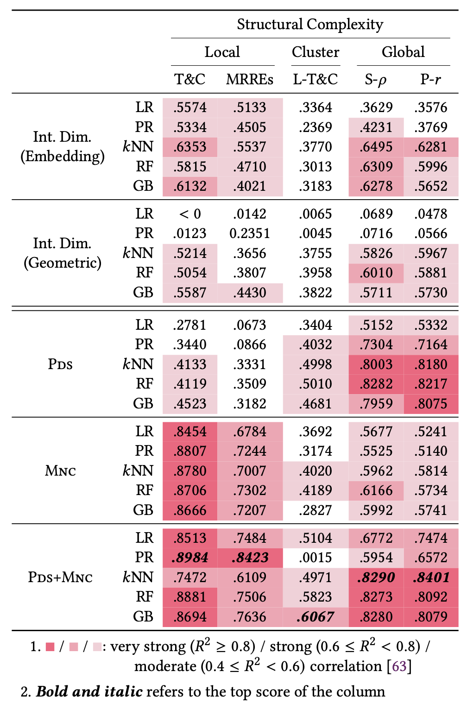
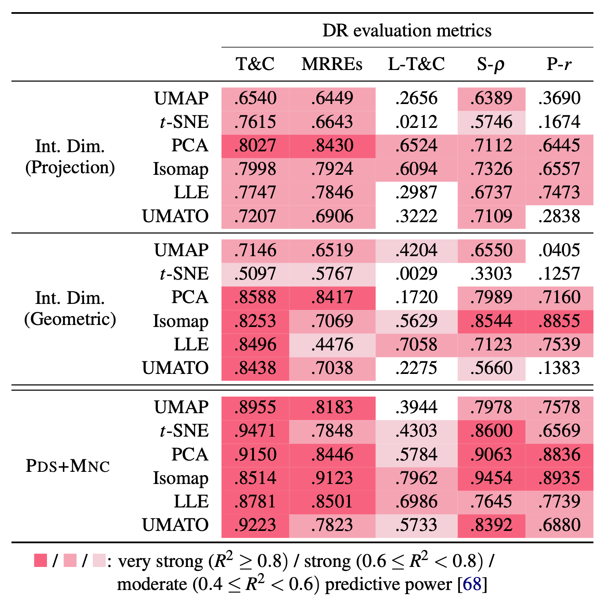
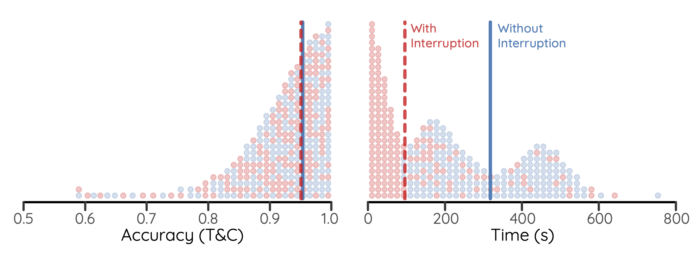
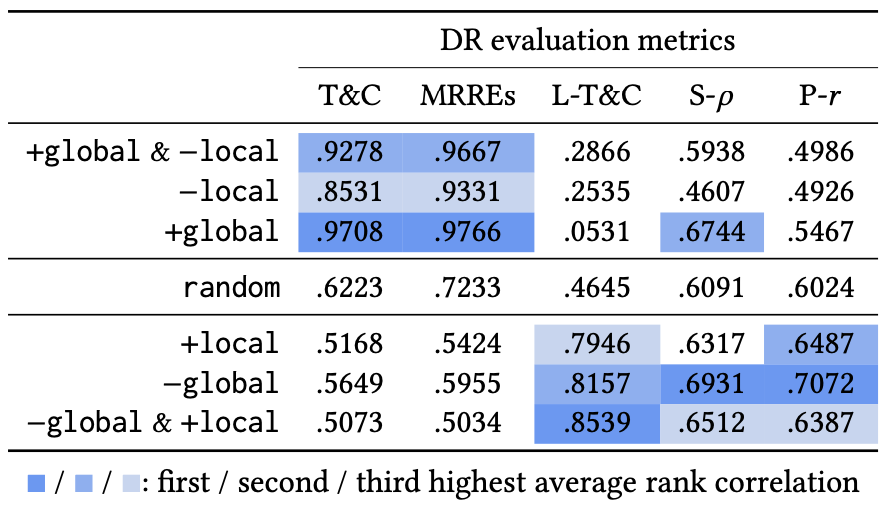

<p align="center">
  <h2 align="center">Structural-Reducibility</h2>
	<p align="center">Repository for Measuring the Structural Reducibility of Datasets for Fast and Accurate Dimensionality Reduction</p>
</p>

---

Dimensionality reduction (DR) is essential for visualizing and analyzing high-dimensional (HD) datasets, yet obtaining accurate DR projections efficiently is challenging. Optimizing DR hyperparameters can be computationally intensive due to the difficulty in identifying the optimal number of iterations. Furthermore, the performance of DR techniques on benchmark datasets often does not generalize well to real-world datasets. To address these issues, we propose measuring the structural reducibility of HD datasets to inform DR optimization and benchmarking. We introduce two metrics—mutual neighbor consistency (MNC) and pairwise distance shift (PDS)—to quantify structural reducibility. These metrics accelerate DR optimization by guiding the number of iterations needed to reach the optima and improve the consistency of DR evaluation results across different datasets. Our experiments show that MNC and PDS are accurate and efficient, outperforming existing methods and addressing practical problems in DR optimization and evaluation.


## Setup

To set up the repository, follow these steps:

1. Clone the repository:
    ```bash
    git clone https://github.com/hj-n/labeled-datasets.git
    ```

2. Navigate to the `labeled-datasets` directory and remove the `npy` zip file:
    ```bash
    cd labeled-datasets
    rm *.zip
    ```

3. Create two virtual environments:
    - For the main requirements:
        ```bash
        python3 -m venv venv
        source venv/bin/activate
        pip install -r Requirements.txt
        ```

    - For the auto-sklearn requirements:
        ```bash
        python3 -m venv venv-autosklearn
        source venv-autosklearn/bin/activate
        pip install -r requirements-autosklearn.txt
        ```

## Usage

### 1. Ground Truth Generation
Generate the ground truth by navigating to the `ground_truth` directory and running the script:
```bash
source ../venv/bin/activate
cd src/ground_truth
python3 _ground_truth.py
```
Check that the `src/ground_truth/result` directory is generated.

### 2. Experiments
Run the experiments in the following order:

#### Experiment 01
Evaluate the correlation of PDS and MNC scores with ground truth structural reducibility.
```bash
python3 exp/01_run_metrics.py
```
Ensure the `src/exp/scores/` directory is generated.

#### Experiment 02
Evaluate how well our reducibility metrics and baselines predict surrogate ground truths. Test the ensemble of PDS and MNC.
```bash
python3 exp/02_accuracy.py
```
<div style="text-align: center;">
    
</div>

#### Experiment 03
Evaluate the speed of our structural reducibility metrics.
```bash
python3 exp/03_time.py
```
<div style="text-align: center;">
    
</div>

### 3. Applications
#### Application 01
**Warning**: Activate the `venv-autosklearn` environment to run this.

- Predicting Maximum Accuracy of DR Techniques:
```bash
python3 app/02_01_prediction.py 
```
- Enhancing Efficiency of DR Optimization:
```bash
python3 app/02_02_optimization.py
```
- Test and Convert to DataFrame:
```bash
python3 app/02_03_test_and_to_df.py
```
<div style="text-align: center;">
    
</div>
<div style="text-align: center;">
    
</div>

#### Application 02
Improve the replicability of DR benchmarks:
```bash
python3 app/03_01_evaluation.py
python3 app/03_02_cleanup.py
```
<div style="text-align: center;">
    
</div>

### 4. Deactivate the Virtual Environment
```bash
deactivate
```
