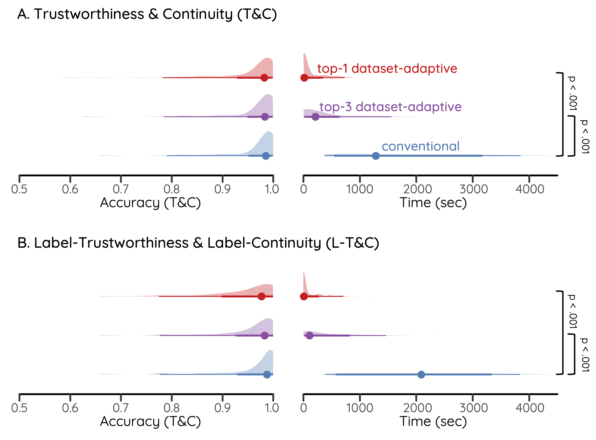

<p align="center">
  <h2 align="center">Dataset-Adaptive Workflow for Optimizing Dimensionality Reduction</h2>
	<p align="center">Repository for the paper <i>Dataset-Adaptive Dimensionality Reduction</i></p>
</p>

---

We introduce the *Dataset-Adaptive workflow* for optimizing dimensionality reduction (DR) techniques, which improves the efficiency of the optimization without comproming the accuracy.
The workflow is based on two *structural complexity metrics*, Pairwise Distance Shift (PDS) and Mutual Neighbor Consistency (MNC).
Our approach is built upon the previous findings that certain patterns are more prominent in HD data.
Based on this finding, our approach first quantifies the prominence of these patterns to estimate the difficulty of accurately projecting the data into lower-dimensional spaces. We
introduce structural complexity metrics to measure these patterns, and use these scores to predict the maximum accuracy achievable by DR techniques.
The metrics thus enhance the efficiency of DR optimization by (1) guiding the selection of an appropriate DR technique for a given dataset and (2) enabling early termination of optimization once near-optimal hyperparameters have been reached, avoiding unnecessary computations.

In this repository, we provide the implementation of two structural complexity metrics and the dataset-adaptive workflow. We also provide the code to reproduce the experiments in our paper.


### Requirements

- Python 3.8+
- Numpy
- Scipy
- Numba

The requirements can be automatically installed by running
```bash
conda create -n complexity python==3.9.0
conda activate complexity
pip install -r requirements.txt
```


## Dataset-Adaptive Workflow

The `/src` directory contains the implementation of the dataset-adaptive workflow. First, `pretrain.py` trains a regression model to predict the maximum achievable accuracy of DR techniques from complexity scores. The `opt.py` file implements the early stopping optimization process, which uses the trained model to guide the selection of DR techniques and stop hyperparameter tuning once the predicted performance is reached.
The `/src/metrics` directory contains the implementation of the two structural complexity metrics, PDS and MNC. The `pds.py` file implements the Pairwise Distance Shift metric, while the `mnc.py` file implements the Mutual Neighbor Consistency metric.


### `pretrain.py`


### `opt.py`

### `modules/opt_conv.py`

Optimize dimensionality reduction (DR) techniques using a conventional approach to find the best hyperparameters (Bayesian optimization with a fixed number of hyperparameters).


### `metrics/mnc.py`

#### `mutual_neighbor_consistency(data, k)`

Computes **Mutual Neighbor Consistency**, a local structure-based complexity metric.  
Measures the cosine similarity between k-NN and SNN similarity vectors.

**Parameters**
- `data` (`np.ndarray`): Input data of shape `(n_samples, n_features)`.
- `k` (`int`): Number of nearest neighbors.

**Returns**
- `float`: Average mutual neighbor consistency (range: 0–1).

### `metrics/pds.py`

#### `pairwise_distance_shift(data)`

Computes **Pairwise Distance Shift**, a global structure-based complexity metric.  
Measures the normalized dispersion of pairwise distances using a log-ratio of std to mean.

**Parameters**
- `data` (`np.ndarray`): Input data of shape `(n_samples, n_features)`.

**Returns**
- `float`: Pairwise distance shift value (higher means more globally structured).

여기까지 완료
--------


```python
from src.pretrain import train_model
import numpy as np

data = np.random.rand(100, 5)
labels = np.random.rand(100)

model = train_model(data, labels, config={"epochs": 10, "lr": 0.001})
model.save("./regression_model.pkl")
```

### Early terminating optimzation
Used to save computation by:

**Step 1 — Selecting Effective DR Techniques**

Predict performance for each technique and skip those with low expected accuracy.

**Step 2 — Early Stopping**

Stop hyperparameter tuning once predicted performance is reached.

```python
from src.opt_early_stop import load_model, run_optimization
import numpy as np

data = np.random.rand(100, 5)
model = load_model("./saved_model.pkl")
output = run_optimization(data, model, technique="UMAP")

print(f"Final Accuracy: {output['accuracy']:.3f}")
print(f"Optimization Steps: {output['steps']}")
```


# Structrual Complexity Metrics
Located in [`/src/metrics/`](src/metrics):
- `pds.py`: Pairwise Distance Shift (global structure)
- `mnc.py`: Mutual Neighbor Consistency (local structure)

### PDS (Pairwise Distance Shift) Example
``` python
from src.metrics.pds import pairwise_distance_shift
import numpy as np

data = np.random.rand(100, 5)
shift_value = pairwise_distance_shift(data)
print(f"PDS: {shift_value:.3f}")
```


### MNC (Mutual Neighbor Consistency) Example
```python
from src.metrics.mnc import mutual_neighbor_consistency
import numpy as np

data = np.random.rand(100, 5)
consistency_value = mutual_neighbor_consistency(data, k=5)
print(f"MNC: {consistency_value:.3f}")
```

# Workflow

### Pretraining

# Reproducing the Experiments

The following are the steps to reproduce the experiments in the paper.
The experiments produce the raw data file that is used to generate the tables and figures in the paper. 


### Setup 

To set up the repository, follow these steps:

1. Download and cleanup datasets
	- Already provided in the repository (for the review process). 

2. Create two virtual environments:
	- For the main requirements:
		```bash
		conda create -n complexity-main python==3.9.0
		conda activate complexity-main
		pip install -r requirements.txt
		```

	- For the auto-sklearn requirements (needs separated environment due to dependency issue in auto-sklearn):
		```bash
		conda create -n complexity-autosklearn python==3.9.18
		conda activate complexity-autosklearn
		pip install -r requirements-autosklearn.txt
		```

conda create -n complexity-autosklearn-3 -c conda-forge python==3.8.0 auto-sklearn numpy bayesian-optimization umap-learn

## Main Experiments

### Experiment 1 — Structural Complexity Metrics

**Path:** `exp/exp1_structural_metrics`

This experiment evaluates the validity of PDS and MNC as structural complexity metrics by comparing them to ground truth model performance and analyzing their correlation with intrinsic dimensionality.

```bash
cd exp/exp1_structural_metrics
bash run.sh
```

**Subscripts:**
- `01_generate_ground_truth.py`: Train regression models to estimate DR effectiveness
- `02_compute_intrinsic_dim.py`: Compute intrinsic dimensionality metrics
- `03_train.py`: Train models using metrics as features
- `04_evaluate.py`: Evaluate correlation with DR performance

**Results:**
<p align="center">    

</p><p align="center">    

</p>

---

### Experiment 2 — Adaptive Workflow

**Path:** `exp/exp2_adaptive_workflow`

Tests whether our structural complexity metrics can support a dataset-adaptive pipeline for model selection and tuning.

```bash
cd exp/exp2_adaptive_workflow
bash run.sh
```

**Subscripts:**
- `01_evaluate_regression_models.py`: Use pretraining to predict best DR methods
- `02_evaluate_predicting_dr.py`: Evaluate ability to guide DR method selection
- `03_evaluate_early_stop.py`: Evaluate optimization efficiency with early stopping

**Results:**
<p align="center">    

</p>
<p align="center">    

</p>
---

### Experiment 3 — Workflow Comparison

**Path:** `exp/exp3_workflow_comparison`

Final experiment that compares the **dataset-adaptive workflow** against a conventional fixed-pipeline workflow.

```bash
cd exp/exp3_workflow_comparison
python evaluate_workflow_improvement.py
```

**Results:**
<p align="center">    

</p>
